<!-- AOC TILES BEGIN -->
<h1 align="center">
  2024 - 37 ⭐ - Python
</h1>
<a href="1. Historian Hysteria/main.py">
  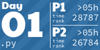
</a>
<a href="2. Red-Nosed-Reports/main.py">
  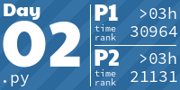
</a>
<a href="3. Mull It Over/main.py">
  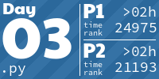
</a>
<a href="4. Ceres Search/main.py">
  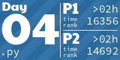
</a>
<a href="5. Print Queue/main.py">
  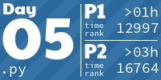
</a>
<a href="6. Guard Gallivant/main.py">
  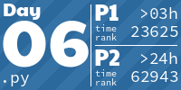
</a>
<a href="7. Bridge Repair/main.py">
  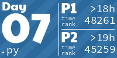
</a>
<a href="8. Resonant Collinearity/main.py">
  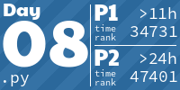
</a>
<a href="9. Disk Fragmenter/main.py">
  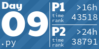
</a>
<a href="10. Hoof It/main.py">
  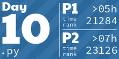
</a>
<a href="11. Plutonian Pebbles/main.py">
  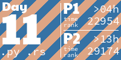
</a>
<a href="12. Garden Groups/main.py">
  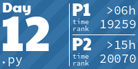
</a>
<a href="13. Claw Contraption/main.py">
  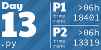
</a>
<a href="14. Restroom Redoubt/main.py">
  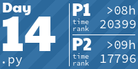
</a>

<a href="17. Chronospatial Computer/main.py">
  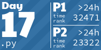
</a>

<a href="19. Linen Layout/main.py">
  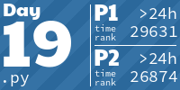
</a>
<a href="20. Race Condition/main.py">
  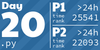
</a>
<!-- AOC TILES END -->
